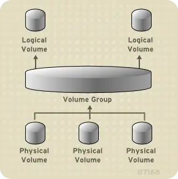
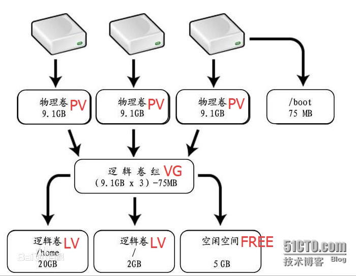
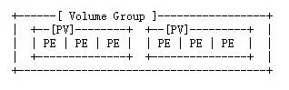
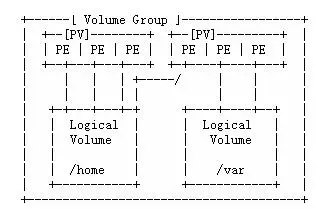
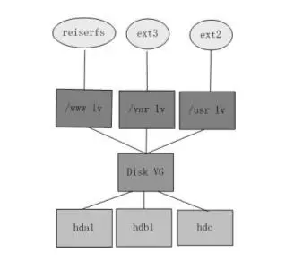

---

## LVM 简介

LVM 是 Logical Volume Manager（逻辑卷管理）的简写，它是 Linux 环境下对磁盘分区进行管理的一种机制。LVM 是在磁盘分区和文件系统之间添加的一个逻辑层，来为文件系统屏蔽下层磁盘分区布局，提供一个抽象的盘卷，在盘卷上建立文件系统，来提高磁盘分区管理的灵活性。通过 LVM 系统管理员可以轻松管理磁盘分区，如：将若干个磁盘分区连接为一个整块的卷组（volume group），形成一个存储池。管理员可以在卷组上随意创建逻辑卷组（logical volumes），并进一步在逻辑卷组上创建文件系统。管理员通过 LVM 可以方便的调整存储卷组的大小，并且可以对磁盘存储按照组的方式进行命名、管理和分配，例如按照使用用途进行定义：“DBdata”和“DBSoft”，而不是使用物理磁盘名“sda”和“sdb”或”hda”和”hdb”。而且当系统添加了新的磁盘，通过 LVM 管理员就不必将磁盘的文件移动到新的磁盘上以充分利用新的存储空间，而是直接扩展文件系统跨越磁盘即可。



LVM 将一个或多个磁盘分区（PV）虚拟为一个卷组（VG），相当于一个大的硬盘，我们可以在上面划分一些逻辑卷（LV）。当卷组的空间不够使用时，可以将新的磁盘分区加入进来。我们还可以从卷组剩余空间上划分一些空间给空间不够用的逻辑卷使用。LVM 模型如下：



物理卷（PV）被由大小等同的基本单元 PE 组成，一个卷组由一个或多个物理卷组成。逻辑卷建立在卷组上。逻辑卷就相当于非 LVM 系统的磁盘分区，可以在其上创建文件系统。





下图是磁盘分区、卷组、逻辑卷和文件系统之间的逻辑关系的示意图：



<br/>

## LVM 基本术语

- 物理存储介质（The physical media）：这里指系统的存储设备：硬盘，如：/dev/hda、/dev/sda 等等，是存储系统最低层的存储单元。

- 物理卷（Physical Volume，PV）：物理卷就是指硬盘分区或从逻辑上与磁盘分区具有同样功能的设备(如 RAID)，是 LVM 的基本存储逻辑块，但和基本的物理存储介质（如分区、磁盘等）比较，却包含有与 LVM 相关的管理参数。

- 卷组（Volume Group，VG）：LVM 卷组类似于非 LVM 系统中的物理硬盘，其由物理卷组成。可以在卷组上创建一个或多个“LVM 分区”（逻辑卷），LVM 卷组由一个或多个物理卷组成。

- 逻辑卷（Logical Volume，LV）：LVM 的逻辑卷类似于非 LVM 系统中的硬盘分区，在逻辑卷之上可以建立文件系统(比如/home 或者/usr 等)。

- PE（Physical Extent）：每一个物理卷被划分为称为 PE(Physical Extents)的基本单元，具有唯一编号的 PE 是可以被 LVM 寻址的最小单元。PE 的大小是可配置的，默认为 4MB。

- LE（Logical Extent）：逻辑卷也被划分为被称为 LE(Logical Extents) 的可被寻址的基本单位。在同一个卷组中，LE 的大小和 PE 是相同的，并且一一对应。

<br/>

## LVM 添加硬盘

新增一块硬盘，大小为 200G，如下：

```bash
user@debian:~$ sudo lsblk
NAME            MAJ:MIN RM  SIZE RO TYPE MOUNTPOINT
fd0               2:0    1    4K  0 disk
sda               8:0    0   40G  0 disk
├─sda1            8:1    0    1G  0 part /boot
└─sda2            8:2    0   39G  0 part
  ├─centos-root 253:0    0   37G  0 lvm  /
  └─centos-swap 253:1    0    2G  0 lvm  [SWAP]
sdb               8:16   0  200G  0 disk
sr0              11:0    1 1024M  0 rom
```

<br/>

### 分区

```bash
user@debian:~$ sudo fdisk /dev/sdb        #执行此命令，进行分区
Welcome to fdisk (util-linux 2.23.2).

Changes will remain in memory only, until you decide to write them.
Be careful before using the write command.

Device does not contain a recognized partition table
Building a new DOS disklabel with disk identifier 0xdf09eb6a.

Command (m for help): p   #在此输入p

Disk /dev/sdb: 214.7 GB, 214748364800 bytes, 419430400 sectors
Units = sectors of 1 * 512 = 512 bytes
Sector size (logical/physical): 512 bytes / 512 bytes
I/O size (minimum/optimal): 512 bytes / 512 bytes
Disk label type: dos
Disk identifier: 0xdf09eb6a

    Device Boot      Start         End      Blocks   Id  System

Command (m for help): n   #在此输入n
Partition type:
    p   primary (0 primary, 0 extended, 4 free)
    e   extended
Select (default p): p
Partition number (1-4, default 1): 1    #在此输入1
First sector (2048-419430399, default 2048):       #回车
Using default value 2048
Last sector, +sectors or +size{K,M,G} (2048-419430399, default 419430399):     #回车
Using default value 419430399
Partition 1 of type Linux and of size 200 GiB is set

Command (m for help): t   #在此输入t
Selected partition 1
Hex code (type L to list all codes): L     #在此输入L

  0  Empty           24  NEC DOS         81  Minix / old Lin bf  Solaris
  1  FAT12           27  Hidden NTFS Win 82  Linux swap / So c1  DRDOS/sec (FAT-
  2  XENIX root      39  Plan 9          83  Linux           c4  DRDOS/sec (FAT-
  3  XENIX usr       3c  PartitionMagic  84  OS/2 hidden C:  c6  DRDOS/sec (FAT-
  4  FAT16 <32M      40  Venix 80286     85  Linux extended  c7  Syrinx
  5  Extended        41  PPC PReP Boot   86  NTFS volume set da  Non-FS data
  6  FAT16           42  SFS             87  NTFS volume set db  CP/M / CTOS / .
  7  HPFS/NTFS/exFAT 4d  QNX4.x          88  Linux plaintext de  Dell Utility
  8  AIX             4e  QNX4.x 2nd part 8e  Linux LVM       df  BootIt
  9  AIX bootable    4f  QNX4.x 3rd part 93  Amoeba          e1  DOS access
  a  OS/2 Boot Manag 50  OnTrack DM      94  Amoeba BBT      e3  DOS R/O
  b  W95 FAT32       51  OnTrack DM6 Aux 9f  BSD/OS          e4  SpeedStor
  c  W95 FAT32 (LBA) 52  CP/M            a0  IBM Thinkpad hi eb  BeOS fs
  e  W95 FAT16 (LBA) 53  OnTrack DM6 Aux a5  FreeBSD         ee  GPT
  f  W95 Ext'd (LBA) 54  OnTrackDM6      a6  OpenBSD         ef  EFI (FAT-12/16/
10  OPUS            55  EZ-Drive        a7  NeXTSTEP        f0  Linux/PA-RISC b
11  Hidden FAT12    56  Golden Bow      a8  Darwin UFS      f1  SpeedStor
12  Compaq diagnost 5c  Priam Edisk     a9  NetBSD          f4  SpeedStor
14  Hidden FAT16 <3 61  SpeedStor       ab  Darwin boot     f2  DOS secondary
16  Hidden FAT16    63  GNU HURD or Sys af  HFS / HFS+      fb  VMware VMFS
17  Hidden HPFS/NTF 64  Novell Netware  b7  BSDI fs         fc  VMware VMKCORE
18  AST SmartSleep  65  Novell Netware  b8  BSDI swap       fd  Linux raid auto
1b  Hidden W95 FAT3 70  DiskSecure Mult bb  Boot Wizard hid fe  LANstep
1c  Hidden W95 FAT3 75  PC/IX           be  Solaris boot    ff  BBT
1e  Hidden W95 FAT1 80  Old Minix
Hex code (type L to list all codes): 8e      #输入lvm类型的hex代码
Changed type of partition 'Linux' to 'Linux LVM'

Command (m for help): p    #在此输入p

Disk /dev/sdb: 214.7 GB, 214748364800 bytes, 419430400 sectors
Units = sectors of 1 * 512 = 512 bytes
Sector size (logical/physical): 512 bytes / 512 bytes
I/O size (minimum/optimal): 512 bytes / 512 bytes
Disk label type: dos
Disk identifier: 0xdf09eb6a

    Device Boot      Start         End      Blocks   Id  System
/dev/sdb1            2048   419430399   209714176   8e  Linux LVM

Command (m for help): w     #保存
The partition table has been altered!

Calling ioctl() to re-read partition table.
Syncing disks.
```

<br/>

### 创建物理卷（Physical Volume，PV）

查看是否已分好区

```bash
user@debian:~$ sudo lsblk
NAME            MAJ:MIN RM  SIZE RO TYPE MOUNTPOINT
fd0               2:0    1    4K  0 disk
sda               8:0    0   40G  0 disk
├─sda1            8:1    0    1G  0 part /boot
└─sda2            8:2    0   39G  0 part
  ├─centos-root 253:0    0   37G  0 lvm  /
  └─centos-swap 253:1    0    2G  0 lvm  [SWAP]
sdb               8:16   0  200G  0 disk
└─sdb1            8:17   0  200G  0 part
sr0              11:0    1 1024M  0 rom
```

创建物理卷 PV

```bash
user@debian:~$ sudo pvcreate /dev/sdb1
  Physical volume "/dev/sdb1" successfully created.
```

查看物理卷创建情况

```bash
user@debian:~$ sudo pvdisplay
  --- Physical volume ---
  PV Name               /dev/sda2
  VG Name               centos
  PV Size               <39.00 GiB / not usable 3.00 MiB
  Allocatable           yes
  PE Size               4.00 MiB
  Total PE              9983
  Free PE               1
  Allocated PE          9982
  PV UUID               jYS4Ia-7Hy9-2r9n-QGqg-Uw2I-B8D7-mQLcoR

  "/dev/sdb1" is a new physical volume of "<200.00 GiB"
  --- NEW Physical volume ---
  PV Name               /dev/sdb1      #这里是我们刚创建的物理卷
  VG Name
  PV Size               <200.00 GiB
  Allocatable           NO
  PE Size               0
  Total PE              0
  Free PE               0
  Allocated PE          0
  PV UUID               NGD0Ox-9ezO-vXk2-xlgo-VuqM-be8n-LBVxtj
```

<br/>

### 使用刚创建的物理卷 PV 创建新的卷组（Volume Group，VG）

#### 创建新卷组

创建卷组的命令为 vgcreate，下面利用它创建了一个名为“debian-vg-2”的卷组，该卷组包含/dev/sdb1、/dev/sdc1 两个物理卷。

```bash
user@debian:~$ sudo vgcreate debian-vg-2 /dev/sdb1 /dev/sdc1
Volume group "debian-vg-2" successfully created
```

注意：对于 LVM1，由于受内核限制的原因，一个逻辑卷（Logic Volume）最多只能包含 65536 个 PE（Physical Extent），所以一个 PE 的大小就决定了逻辑卷的最大容量，4 MB 的 PE 决定了单个逻辑卷最大容量为 256 GB，若希望使用大于 256G 的逻辑卷，则创建卷组时需要指定更大的 PE。在 Red Hat Enterprise Linux AS 4 中 PE 大小范围为 8 KB 到 16GB，并且必须总是 2 的倍数。例如，如果希望使用 64 MB 的 PE 创建卷组，这样逻辑卷最大容量就可以为 4 TB 。如果希望创建一个使用全部卷组的逻辑卷，则需要首先通过 vgdisplay 察看该卷组的 Total PE 数，然后在创建逻辑卷时指定。<u>**以上仅 lvm1 对此有限制，lvm2 无此限制。</u>**

查看创建的卷组：

```bash
user@debian:~$ sudo vgdisplay
  --- Volume group ---
  VG Name               debian-vg-2
  System ID
  Format                lvm2
  Metadata Areas        1
  Metadata Sequence No  2
  VG Access             read/write
  VG Status             resizable
  MAX LV                0
  Cur LV                1
  Open LV               1
  Max PV                0
  Cur PV                1
  Act PV                1
  VG Size               <500.00 GiB
  PE Size               4.00 MiB
  Total PE              127999
  Alloc PE / Size       76800 / 300.00 GiB
  Free  PE / Size       51199 / <200.00 GiB
  VG UUID               RC9Kbc-g3gc-ilcL-o3a0-AnVP-N1xk-Yo9eS9
```

激活刚刚创建的卷组，否则 df -h 命令无法看到。

```bash
user@debian:~$ sudo vgchange -a y debian-vg-2
  0 logical volume(s) in volume group "debian-vg-2" now active
```

#### 创建新的逻辑卷（Logical Volume，LV）并挂载

创建逻辑卷(创建一个 15G 的 LV)

```bash
user@debian:~$ sudo lvcreate -L 15G -n data debian-vg-2
  Logical volume "data" created
```

也可以输入 `lvcreate -l 100%VG -n data debian-vg-2` 创建一个占用全部卷组的逻辑卷，或者输入 `lvcreate -l 80% -n data debian-vg-2` 创建一个占用 80%剩余空间的逻辑卷。

查看新创建的 LV

```bash
user@debian:~$ sudo lvdisplay
  --- Logical volume ---
  LV Path                /dev/debian-vg-2/data
  LV Name                data
  VG Name                debian-vg-2
  LV UUID                diuGxk-0COv-P2lk-y0qV-D6XY-MjKE-ed1VvU
  LV Write Access        read/write
  LV Creation host, time debian, 2022-08-27 22:39:23 +0800
  LV Status              available
  # open                 1
  LV Size                300.00 GiB
  Current LE             76800
  Segments               1
  Allocation             inherit
  Read ahead sectors     auto
  - currently set to     256
  Block device           254:2
```

格式化新创建的 LV

```shell
mkfs -t ext4 /dev/debian-vg-2/data
```

将新创建的逻辑卷激活并挂载

```bash
user@debian:~$ sudo mount /dev/sdb1 /data
```

以上命令每次重启电脑后都会丢失，导致开机启动程序失败，因此需要修改/etc/fstab，实现开机自动挂载。

```bash
user@debian:~$ sudo vim /etc/fstab
```

打开文件，在最下面一行添加如下语句，保存退出。

```textile
/dev/mapper/debian--vg--2-data /data    ext4   defaults   0   2
```

此文件的详细介绍可参考[/etc/fstab 文件详解](https://www.jianshu.com/p/91de994e4b6c)。

<br/>

### 使用刚创建的物理卷 PV 扩展已有卷组（Volume Group，VG）

查看卷组情况

```bash
user@debian:~$ sudo vgdisplay
  --- Volume group ---
  VG Name               debian-vg-2 #卷组的名称
  System ID
  Format                lvm2
  Metadata Areas        1
  Metadata Sequence No  3
  VG Access             read/write
  VG Status             resizable
  MAX LV                0
  Cur LV                2
  Open LV               2
  Max PV                0
  Cur PV                1
  Act PV                1
  VG Size               <39.00 GiB
  PE Size               4.00 MiB
  Total PE              9983
  Alloc PE / Size       9982 / 38.99 GiB
  Free  PE / Size       1 / 4.00 MiB
  VG UUID               oIgyce-IO2t-FegU-Kgvb-n2Us-6K3u-rbJCdy
```

将新的分区/dev/sdb1 加入到卷组中，这里的卷组名为 centos

```bash
user@debian:~$ sudo vgextend centos /dev/sdb1
  Volume group "centos" successfully extended
```

添加完成后再次查看卷组信息

```bash
user@debian:~$ sudo vgdisplay
  --- Volume group ---
  VG Name               debian-vg-2os
  System ID
  Format                lvm2
  Metadata Areas        2
  Metadata Sequence No  4
  VG Access             read/write
  VG Status             resizable
  MAX LV                0
  Cur LV                2
  Open LV               2
  Max PV                0
  Cur PV                2
  Act PV                2
  VG Size               238.99 GiB     #可以看到容量已经增加了200G
  PE Size               4.00 MiB
  Total PE              61182
  Alloc PE / Size       9982 / 38.99 GiB
  Free  PE / Size       51200 / 200.00 GiB
  VG UUID               oIgyce-IO2t-FegU-Kgvb-n2Us-6K3u-rbJCdy
```

#### 扩容已有分区

下面是对现有分区进行逻辑卷扩容，我们这里根分区为 40G，我们准备扩容根分区
查看根分区的 LV 路径

```bash
user@debian:~$ sudo df -h
Filesystem               Size  Used Avail Use% Mounted on
devtmpfs                 7.8G     0  7.8G   0% /dev
tmpfs                    7.8G     0  7.8G   0% /dev/shm
tmpfs                    7.8G  8.9M  7.8G   1% /run
tmpfs                    7.8G     0  7.8G   0% /sys/fs/cgroup
/dev/mapper/centos-root   37G  1.7G   36G   5% /
/dev/sda1               1014M  179M  836M  18% /boot
tmpfs                    1.6G     0  1.6G   0% /run/user/0
```

或者通过 lvdisplay 一样可以查看，这里的路径为`/dev/mapper/centos-root`，下面进行扩容

```bash
user@debian:~$ sudo lvextend -l +100%FREE /dev/mapper/centos-root
  Size of logical volume centos/root changed from 36.99 GiB (9470 extents) to 236.99 GiB (60670 extents).
  Logical volume centos/root successfully resized.
```

查看扩容后的逻辑卷大小

```bash
user@debian:~$ sudo lvdisplay /dev/mapper/centos-root
  --- Logical volume ---
  LV Path                /dev/centos/root
  LV Name                root
  VG Name                centos
  LV UUID                tnXHPR-Abe6-BNL4-6EdH-bgZI-UgDM-BfCHrm
  LV Write Access        read/write
  LV Creation host, time localhost, 2019-09-23 17:31:21 +0800
  LV Status              available
  # open                 1
  LV Size                236.99 GiB
  Current LE             60670
  Segments               2
  Allocation             inherit
  Read ahead sectors     auto
  - currently set to     8192
  Block device           253:0
```

然后使用 xfs_groupfs 进行在线调整 xfs 格式的文件系统大小

```bash
user@debian:~$ sudo xfs_growfs /dev/mapper/centos-root
meta-data=/dev/mapper/centos-root isize=512    agcount=4, agsize=2424320 blks
          =                       sectsz=512   attr=2, projid32bit=1
          =                       crc=1        finobt=0 spinodes=0
data     =                       bsize=4096   blocks=9697280, imaxpct=25
          =                       sunit=0      swidth=0 blks
naming   =version 2              bsize=4096   ascii-ci=0 ftype=1
log      =internal               bsize=4096   blocks=4735, version=2
          =                       sectsz=512   sunit=0 blks, lazy-count=1
realtime =none                   extsz=4096   blocks=0, rtextents=0
data blocks changed from 9697280 to 62126080
```

最后查看下根分区的大小是否扩容成功

```bash
user@debian:~$ sudo df -h
Filesystem               Size  Used Avail Use% Mounted on
devtmpfs                 7.8G     0  7.8G   0% /dev
tmpfs                    7.8G     0  7.8G   0% /dev/shm
tmpfs                    7.8G  8.9M  7.8G   1% /run
tmpfs                    7.8G     0  7.8G   0% /sys/fs/cgroup
/dev/mapper/centos-root  237G  1.7G  236G   1% /
/dev/sda1               1014M  179M  836M  18% /boot
tmpfs                    1.6G     0  1.6G   0% /run/user/0
```

<br/>

## 参考文章

- [LVM 添加硬盘并扩容至已有分区](https://cloud.tencent.com/developer/article/1671893)
- [LVM 原理及 PV、VG、LV、PE、LE 关系图](https://blog.csdn.net/lenovouser/article/details/54233570)
- [Debian 设置允许 root 用户以 ssh 方式登录 - 掘金](https://juejin.cn/post/6939428723783368735)
- [Linx 卷管理详解 VG LV PV](https://www.jianshu.com/p/7ed13162c8bf)
- [Linux 启动自动 mount_Linux 教程\_Linux 公社-Linux 系统门户网站](https://www.linuxidc.com/Linux/2012-04/59110.htm)
- [linux 如何 mount 挂载磁盘并设置开机自动 mount*神芷迦蓝寺的博客-CSDN 博客*自动 mount](https://blog.csdn.net/mochou111/article/details/81298613)
- [/etc/fstab 文件的详解*韩帅平的博客-CSDN 博客*/etc/fstab](https://blog.csdn.net/youmatterhsp/article/details/83933158)
- [/etc/fstab 文件详解](https://www.jianshu.com/p/91de994e4b6c)
