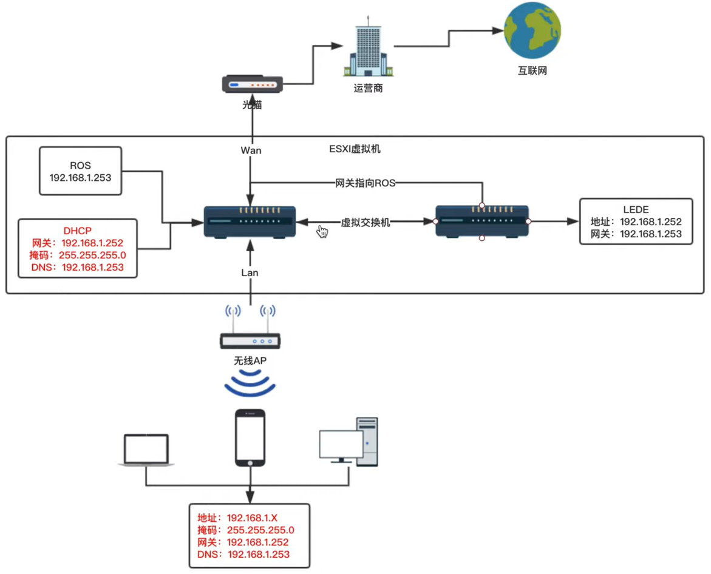

---

## 概论

### 软路由配置建议

- 仅装路由系统：J1900 + 2G 内存
- 一机多用+功能最大化：支持 VT-d 技术的 CPU + 大内存 => 虚拟机
- VT-d 技术：虚拟化直通技术，LEDE 系统可以绕过虚拟平台，直接使用硬件资源
- 如需在软路由上玩虚拟化，最好选择 Intel 网卡
- 硬盘的读写速度不会影响裸装软路由的性能
- 裸装软路由的内存消耗大约只有 200+MB，大的内存不会提生速度，一般分配 1GB 内存足够
- CPU 对软路由的性能起决定性作用，网卡决定了稳定性的好坏

### 软路由多网口的意义

- 多条宽带接入，需要多个 WAN 口
- 软路由内网传输需要消耗一定的 CPU 资源，因此不建议作为交换机使用
- 性能不好的软路由，最好搭配交换机

### 软路由 CPU 比较

| CPU       | 频率    | 规格        | 功耗 | 单线程分数 | 多线程分数 | 虚拟化技术（VT-x） | 定向虚拟化（VT-d） | AES 指令集 | 参考价格 |
| --------- | ------- | ----------- | ---- | ---------- | ---------- | ------------------ | ------------------ | ---------- | -------- |
| J1900     | 1.99GHz | 4 核 4 线程 | 10W  | 535        | 1839       | Y                  | N                  | N          | 600 起   |
| 3205U     | 1.50GHz | 2 核 2 线程 | 15W  | 803        | 1499       | Y                  | Y                  | N          | 750 起   |
| ==3215U== | 1.70GHz | 2 核 2 线程 | 15W  | 915        | 1641       | Y                  | Y                  | N          | 无货     |
| 3855U     | 1.60GHz | 2 核 2 线程 | 15W  | 881        | 1680       | Y                  | Y                  | Y          | 1100 起  |
| 3865U     | 1.80GHz | 2 核 2 线程 | 15W  | 1016       | 1898       | Y                  | Y                  | Y          | 1100 起  |
| i3 7100U  | 2.40GHz | 2 核 4 线程 | 15W  | 1359       | 3767       | Y                  | Y                  | Y          | 1800 起  |
| i5 7200U  | 2.50GHz | 2 核 4 线程 | 15W  | 1723       | 4603       | Y                  | Y                  | Y          | 2000 起  |
| i5 7300U  | 2.60GHz | 2 核 4 线程 | 15W  | 1963       | 5188       | Y                  | Y                  | Y          | 2000 起  |
| i7 7500U  | 2.7 GHz | 2 核 4 线程 | 15W  | 1916       | 5154       | Y                  | Y                  | Y          | 2200 起  |

- AES 指令集：科学上网需要加密解密过程，如果 CPU 支持此指令集将大大降低其加密解密负荷。注意，并不是所有支持 AES 的 CPU 都有显著的性能提升。
- 软路由系统更看重 CPU 的单线程能力，因其对软路由的性能影响最大。
- 高等级 CPU 只适合折腾虚拟机，否则若只跑软路由将造成性能过剩，因为此时的瓶颈在带宽上（300M）。
- 虚拟机玩家建议 CPU i3 以上，内存 8G 以上。

<br/>

## LEDE + RouterOS 双软路由系统

LEDE 如果安装插件过多将导致不稳定，因此将其功能分解为两大块：主路由负责网络核心功能，如拨号，多线负载，宽带叠加等；旁路由负责科学上网、去广告等功能。同时，由于两个软路由系统都安装在虚拟机内部，因此它们之间的数据交换也在虚拟机内部完成，不存在所谓硬件连接的性能问题。

目前主路由系统使用最多的是 iKuai 和 RouterOS。

RouterOS 内存使用量极低，一般几十 MB 左右，CPU 使用量也极低，普通上网情况下不超过 5%。此外，ROS 还包含拨号上网，DNS 换存等实用功能。最大的缺点是没有科学上网功能。

旁路由系统，也有人称其为二级路由，但作为旁路由他没有路由功能，作为二级路由他又和主路由在同一网段下，没有隔离网段。因此称其为旁路网关可能更贴切一些。目前带科学上网功能的软路由系统只有两个：KoolShare 的 LEDE，和恩山 L 大的 OpenWrt。上述两个系统都属于 OpenWrt，由于之前的 LEDE 已经合并，因此目前只有 OpenWrt。

### 双路由系统的连接



主路由 ROS 只使用两个网口，WAN 连接光猫，LAN 连接无线 AP。在虚拟机内部，两者使用同一个虚拟交换机进行数据交换，旁路由的 LAN 接主路由的 LAN。为了科学上网，需要设置终端设备的网关为旁路由的 IP，让请求数据先经过旁路由。如果设备过多，逐一给终端设备设置网关会很困难，此时可以通过设置主路由的 DHCP 功能解决。主路由的 DHCP 可以自动将旁路由的 IP 分配给终端设备，作为后者的网关。

请求首先经过无线 AP，通过主路由的 LAN 口到达主路由，之后通过虚拟机内部的交换机到达旁路由。随后，旁路由的科学上网插件处理请求数据（加密），处理完的请求数据需要根据旁路由内部设置的网关发送给下一个目标，因此需要将旁路由的网关设置为主路由的 IP。

总结：双软路由系统需要将所有终端设备的网关指向旁路由，再将旁路由的网关指向主路由。

### 软路由上的虚拟化平台选择

PVE 和 ESXI 是主流的两种软路由虚拟化平台。PVE 的启动速度更快，内存消耗更低，而且不跳硬件。实际使用时，在软路由上网的应用场景下，PVE 的表现不如 ESXI。

<br/>

## 虚拟机系统 ESXi 的安装与设置

### 相关资源链接和注意事项

- [vSphere Hypervisor (ESXi 7.x)下载](https://customerconnect.vmware.com/downloads/info/slug/datacenter_cloud_infrastructure/vmware_vsphere/7_0)
- [文档和硬件要求](https://docs.vmware.com/cn/VMware-vSphere/7.0/com.vmware.esxi.install.doc/GUID-DEB8086A-306B-4239-BF76-E354679202FC.html)
- [Rufus - 开源 USB 启动盘制作工具](http://rufus.ie/)

> Exsi7.0 在 256GB 以下存储设备安装无可用空间原因和解决方案
>
> ESXI7.0，第一次进入安装时，按 shift + O
> 在显示的`runweasel cdromBoot`后输入`autoPartitionOSDataSize=8192`注意大小写
> 8192 表示指定 OSDataSzie 为 8GB，再按 enter 回车进行正常安装即可；
> 对比 6.7 系统，给出 8GB 完全可以满足 VMware tools、scratch 以及 coredump 空间的需求。
> 这样指定了空间大小，就不存在自动划分那么大的空间了

### 设置硬件直通加速

进入 ESXi 管理页面，选择**管理=>硬件**，筛选器选择**支持直通**，勾选除第一个以外的全部网卡，点击**切换直通**，之后点击**重新引导主机**重启，完成。此时在**网络=>物理网卡**页面下只能看到只有一个网卡，之后可以给虚拟机添加直通设备。在创建虚拟机的自定义设置里点击**添加其他设备=>PCI 设备**，则会自动添加硬件加速的网卡，直到无网卡可用，按钮置灰。之后注意设置内存内勾选**预留所有客户机内存(全部锁定)**，否则虚拟机无法启动。

此外，还应打开虚拟交换机的混杂模式，点击**网络=>虚拟交换机=>v Switch0=>编辑设置=>安全**，将其内部的混杂模式、MAC 地址更改、伪传输全部置为接受。否则只有第一个网口可以访问 ESXi 控制台页面。

<br/>

## iKuai 安装和设置

### 安装

vmware 安装中建议选择**客户机操作系统版本**为 ubuntu64 位，否则默认网卡类型是 AMD，该类型的虚拟网卡性能很差。[参考文章](https://www.ikuai8.com/index.php?option=com_content&view=article&id=51&Itemid=142#mark)

建议配置 1024MB 内存，2GB 硬盘。

### 设置

首先设置 DHCP，进入管理页面，点击**网络设置=>DHCP 设置=>DHCP 服务端=>添加**，设置服务接口为 lan1，客户端地址为 192.168.7.31~192.168.7.200，网关设置为 iKuai 的 Lan 口 IP(如果是双软路由系统需要设置为 lede 的 Lan 口 IP)，首选 DNS 建议设置为光猫的 IP，备选 DNS 设置为 114.114.114.114。点击保存。

其次设置 wan 口和网桥，点击**网络设置=>内外网设置**，点击外网网口 wan1，网卡选择 eth3，点击**绑定=>保存**。点击内网网口 lan1，展开高级设置，在扩展网卡中勾选其余网口，点击保存。

<br/>

## RouterOS 的安装设置指南

### 下载和安装

首先需要在官网下载 Cloud Hosted Router 版本的 OVA 安装包。注意 6.x 版本不支持 Intel i211 网卡，因此建议下载 7.x 版本。[下载链接](https://mikrotik.com/download) [文档](https://www.veewe.com/)

在 ESXi 上安装过程只需使用 OVA 进行安装即可，注意网卡直通需要锁定客户机内存，硬盘格式可用 SCSI 控制器。由于 ROS 初始安装时网口的顺序随机，安装过程中注意只有 ETH0 接口有网线，否则初始的控制口会被设置为插着网线的其他网口。安装好后可通过以下命令查看相关系统信息。

```shell
# ROS常用命令
interface print # 查看网卡接口
ip address add address=192.168.7.1/24 interface=ether1 # 给网口添加IP地址
ip address remove 0 # 移除接口的IP地址
system reboot # 重启系统
system shutdown # 关闭系统
system reset # 恢复初始状态
ip export # 查看IP配置
ip address print # 同上
system license print # 查看授权
```

### 连接和配置

7.x 版本暂不支持 WinBox Mac 地址直连，因此需要先在 ROS 的 shell 环境配置 IP 和网口。默认账号为 admin，无默认密码。

首先使用`interface print`命令查看网口信息，之后用`ip export`查看 IP 信息。然后 ip address add 设置 LAN0 网口的 IP，即当前软路由插着网线的网口 IP。之后可通过浏览器或 WinBox 连接。

由于目前网口的命名是随机的，首先需要配置 interface，将各个网口命名，尤其注意设置 LAN0 口和 WAN 口。一般一直有流量的口是 LAN0 口，之后可通过插网线到每个端口上看看是否有流量变化确定各个网口。

设置 DHCP Client。由于软路由连光猫，由光猫负责拨号，因此只需配置 ROS 为 DHCP Clint 即可。进入 IP => DHCP Client => Add New，Interface 选择 WAN 口，其余默认，OK。

设置防火墙的 NAT 设置 (IP 伪装)。进入 IP => Firewall => NAT => Add New => Action，设置 Action 为 masquerade(伪装)，其余默认，OK。

设置 DHCP Server。进入 IP => DHCP Server => DHCP => DHCP Setup，依次设置 DHCP Server Interface 为 LAN0；DHCP Address Space 为 192.168.7.0/24；Gateway for DHCP Network 为 192.168.7.1 (ROS 的 IP)；设置 Addresses to Give Out(动态地址分配范围)为 192.168.7.31192.168.7.200；设置 DNS Server 为光猫上的 DNS 地址，同时可以添加一个备用的 114.114.114.114；Lease Time 保持默认。以上操作可一次性设置好 DHCP Server 和 DNS。

设置网桥连通其他几个 LAN 口。[文档](https://www.veewe.com/14-bridge%e6%a1%a5%e7%9a%84%e7%ae%80%e4%bb%8b.html) _未成功_

设置 DNS 代理。

激活永久免费试用版。进入 System => License，点击 Renew License，输入 MikroTik 的账号密码，选择 Level 为 P Unlimited，点击 Start 开始注册，设置完成。此时用此账号登录 MikroTik 官网，在其中的 CHR LICENSES => All CHR keys，可以找到刚才的注册信息。

<br/>

## LEDE

### LEDE 仓库准备

- 首先 Fork `https://github.com/coolsnowwolf/lede
- 其次，参考 https://github.com/KFERMercer/OpenWrt-CI，上传`openwrt-ci.yml`和`merge-upstream.yml`到刚才Fork的`/.github/workflows/`下。
- 由于 Fork 的`coolsnowwolf/lede`没有 PassWall 组件，需要参考 https://github.com/kenzok8/openwrt-packages，添加相关package到自己的仓库。

### 编译虚拟机准备

使用 Ubuntu Server 20.04 LTS x64 虚拟机，注意创建时设置 80G 硬盘，且在安装步骤中的 Storage Configuration 页面手动调整 ubuntu-lv 的硬盘大小不小于 60G。配置软件源为http://mirrors.aliyun.com/ubuntu。详细过程可参考[Ubuntu 20.04 live server 版安装(详细版)](https://www.cnblogs.com/mefj/p/14964416.html)。

虚拟机创建完成后输入以下命令，参考 https://github.com/coolsnowwolf/lede。

```shell
sudo apt-get update
sudo apt-get -y install build-essential asciidoc binutils bzip2 gawk gettext git libncurses5-dev libz-dev patch python3 python2.7 unzip zlib1g-dev lib32gcc1 libc6-dev-i386 subversion flex uglifyjs git-core gcc-multilib p7zip p7zip-full msmtp libssl-dev texinfo libglib2.0-dev xmlto qemu-utils upx libelf-dev autoconf automake libtool autopoint device-tree-compiler g++-multilib antlr3 gperf wget curl swig rsync
# 初始化git
ssh-keygen
git config --global user.name "<username>"
git config --global user.email "<username>@***.***"
git clone <上一步准备好的lede仓库>
# 准备配置菜单
./scripts/feeds update -a
./scripts/feeds install -a
make menuconfig
```

推荐主题：ifit、Argon、Netgear、Edge。**LuCI => Applications**详细配置可参考[OpenWrt 编译 LuCI -> Applications 添加插件应用说明-L 大](https://www.right.com.cn/forum/thread-344825-1-1.html)、[OpenWRT 编译 make menuconfig 配置及 LUCI 插件说明.xlsx](https://docs.google.com/spreadsheets/d/1e1pvol-9QK6HgkbqRRmtqlOUaeVr_SxIiopd4foi6q4/edit#gid=18734276)。

如果是本地编译，则按照 lede 的说明进行操作即可。如果需要使用 Github 的 Action 进行在线编译，则参考 https://github.com/KFERMercer/OpenWrt-CI 进行。

注意如果在使用 Github 的 Action 时需要定制化 lede，按如下步骤进行。

```shell
# https://github.com/coolsnowwolf/lede/issues/2288
make defconfig
./scripts/diffconfig.sh > seed.config
```

之后将 seed.config 中的内容复制粘贴到`/.github/workflows/openwrt-ci.yml`的指定位置中，然后提交。

```yaml
          #
          # 在 cat >> .config <<EOF 到 EOF 之间粘贴你的编译配置, 需注意缩进关系
          # 例如:
          cat >> .config <<EOF
          # 将seed.config的内容粘贴在这里
          EOF
          #
          # ===============================================================
          #
```

### 在 ESXi7 系统上安装

参考[如何在#VMWare #ESXi 6.7 上安装 OpenWrt 虚拟机充当旁路由](https://xmanyou.com/vmware-esxi-install-openwrt/)

- 首先，在 ESXi 管理页面打开 SSH，右击主机 => 服务 => 启用 Secure Shell (SSH)。

- 其次，将编译出的 OpenWrt 镜像`openwrt-x86-64-generic-squashfs-combined-efi.vmdk`，改名为`openwrt.vmdk`，上传到 ESXi 存储目录。

- 使用 MobaXterm 远程登录到 ESXi Shell 页面，依次输入以下命令

  ```sh
  cd /vmfs/volumes/datastore1/<存放vmdk文件的目录，如iso>
  # 使用vmkfstools将不支持的.vmdk转换为ESXi支持的.vmdk格式
  vmkfstools -i openwrt.vmdk openwrt.esxi7.vmdk # <旧的.vmdk> <新的.esxi7.vmdk>
  ```

- 之后创建虚拟机，选择**创建新虚拟机**，系统选择其他 Linux64 位，硬件中删除 USB、硬盘，建议内存 2GB。
- 创建成功后将之前生成的`openwrt.esxi7.vmdk`文件==复制到==刚才创建的虚拟机文件夹中，编辑虚拟机，添加硬盘选择刚才的 vmdk 文件，启动虚拟机。之后马上断电，再次编辑虚拟机，将之前的硬盘容量设置为 1GB，启动虚拟机，安装 lede。
- 安装完成后应该修改静态 IP 地址，输入`vim /etc/config/network`，找到 option ipaddr '192.168.1.1'，修改为你要设定的 IP，保存退出，输入 reboot 重启 OpenWrt。

### 路由配置

首先配置旁路由**OpenWrt/lede**：(默认账号密码为 admin 和 password)

- 进入**网络 => 接口**，删除其余接口，只保留 Lan 口。点击修改，设置**IPv4 网关**为主路由 IP(如 192.168.7.1)，**IPv4 广播**为最后一位置 0 的 IPv4 地址(如 192.168.7.0)，**使用自定义的 DNS 服务器**设置为光猫的 IP ==(一定要设置)==，同时可添加额外的公共 DNS 服务器，如 114.114.114.114 或 233.5.5.5。禁用此端口的**DHCP 服务器**功能(勾选**忽略此接口**)，同时禁用 DHCP IPv6，点击**保存&应用**。
- 由于 lede 只作为旁路由使用，防火墙只需在主路由中设置，因此可关闭防火墙，进入**网络 => 防火墙**，取消勾选**启用 SYN-flood 防御**，同时在区域中删除其他网口，只保留 lan 口，点击**保存&应用**。

之后配置主路由，DHCP 服务端设置网关为旁路由的 IP 即可。

另外，==(未证实)==，为了能成功实现科学上网，主路由的 DNS 必须指向旁路由**(OpenWrt/lede)**的 IP，使用旁路由进行 DNS 代理。否则，一但科学上网插件出了问题，将导致无法上网。所以需要设置主路由 DHCP 的 DNS 指向旁路由的 IP。

### 其他参考资料

- [轻松编译 Openwrt 固件支持 V2ray 和 Trojan-下篇](https://mianao.info/2020/03/02/%E8%BD%BB%E6%9D%BE%E7%BC%96%E8%AF%91Openwrt%E5%9B%BA%E4%BB%B6%E6%94%AF%E6%8C%81V2ray%E5%92%8CTrojan-%E4%B8%8B%E7%AF%87)
- [编译更新 OpenWrt PassWall 和 SSR-plus 插件](https://mianao.info/2020/05/05/%E7%BC%96%E8%AF%91%E6%9B%B4%E6%96%B0OpenWrt-PassWall%E5%92%8CSSR-plus%E6%8F%92%E4%BB%B6)
- [ESXI+ROS+LEDE 问题求解，只有管理口能上网](https://koolshare.cn/thread-172326-1-1.html)

<br/>

## OpenWrt 使用

### KMS 服务激活 Office

首先，必须是 VOL 版本的 windows 和 office 才能使用此法激活。如何区分？注意下载的 ISO 文件是以什么开头，一般 cn 开头的是零售版，sw 开头的是 VOL 版。其次，进入到 Office 的安装目录，如`C:\Program Files (x86)\Microsoft Office\Office16`。进去这个目录，可以看见有个 OSPP.VBS 文件。然后，以管理员身份打开`cmd`控制台，输入如下语句。注意此处必须以管理员身份运行。

```powershell
cscript ospp.vbs /sethst:192.168.7.2 # 你的OpenWrt路由IP
```

一般来说，“一句命令已经完成了”，但一般 office 不会马上连接 kms 服务器进行激活，所以我们额外补充一条手动激活命令。（经测试，此步骤可以省略）

```powershell
cscript ospp.vbs /act
```
