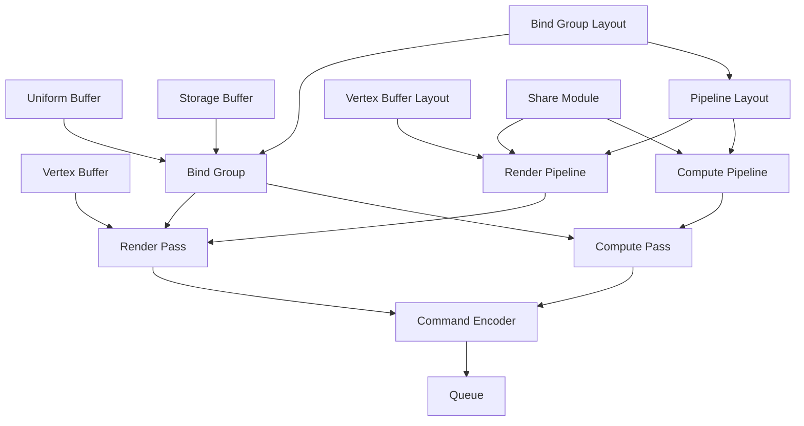

## 渲染流程

## WebGPU 各个实例的包含关系

由图可知：

- Vertex Buffer 数据可以独立地注入通道，而其他的 Buffer（Uniform、Storage）只能通过 Bind Group 注入。

## FAQ

### 使用暂存缓冲区的意义

GPU 在很大程度上是以延迟为代价来优化吞吐量的。GPU 需要惊人的高速度将数据输送到核心，以维持该吞吐量。为了适应今天的图形需求，GPU 需要以更快的速度处理数据。只有当 GPU 的内存与核心非常紧密地结合在一起时，这才有可能实现。这种紧密的集成使其很难将相同的内存暴露给主机进行读写。

不过，GPU 有主机和 GPU 都可以访问的额外内存区块，但集成不是很紧密，读写速度也不是很快。暂存缓冲区就是在这个中间内存区分配的缓冲区，它可以**映射**到主机系统中进行读写。为了从 GPU 读取数据，我们将数据从内部的高性能缓冲区复制到一个暂存缓冲区，然后将暂存缓冲区映射到主机，这样我们就可以将数据读回主内存。对于写入，过程也是一样的，但顺序相反。

## 参考资料

- [WebGPU — All of the cores, none of the canvas](https://surma.dev/things/webgpu/)
- [您的第一个 WebGPU 应用](https://codelabs.developers.google.com/your-first-webgpu-app?hl=zh-cn#0)
