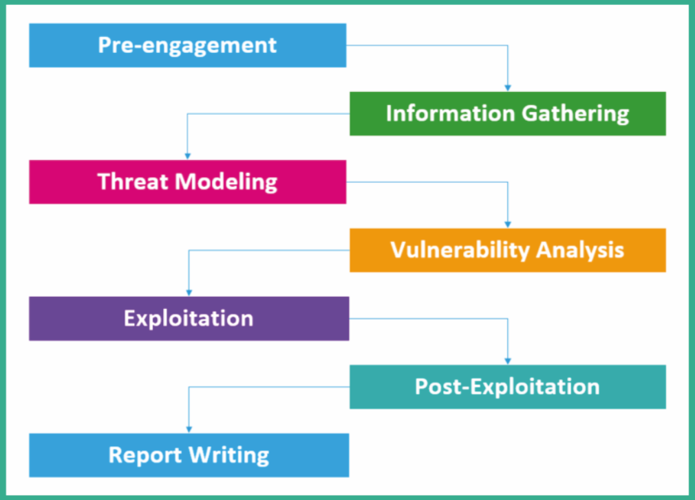
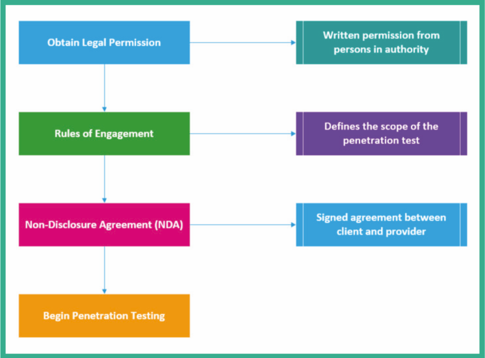

## 渗透测试的不同阶段：

### 测评前准备 (Pre-engagement)

关键人员提供信息，协调资源，帮助渗透测试人员理解测评中约定的范围、广度和规则。以及法律方面的准备，包括保密协议(NDA)和咨询服务协议(CSA)。下图是实际进行渗透测试过程前的准备流程。

### 信息收集 (Information Gathering)

### 威胁建模 (Threat modeling)

威胁建模是一种用于协助渗透测试人员和网络安全防御者的过程，以更好地了解启发评估或应用程序或网络最容易受到评估的威胁。然后，该数据用于帮助渗透测试人员模拟，评估和解决组织，网络或应用程序面孔最常见的威胁。以下是一些威胁建模框架。

- 欺骗、篡改、拒绝、信息披露、拒绝服务器和特权提升(STRIDE)
- 攻击模拟和威胁分析流程(PASTA)

### 漏洞分析 (Vulnerability analysis)

渗透测试人员运行漏洞或网络/端口扫描，以更好地了解那些网络上运行的服务或者系统上运行的程序，并发掘出这些服务或程序是否存在评估范围内的漏洞。

### 漏洞验证 (Exploitation)

### (Post-exploitation)

### 编写报告(Report writing)
