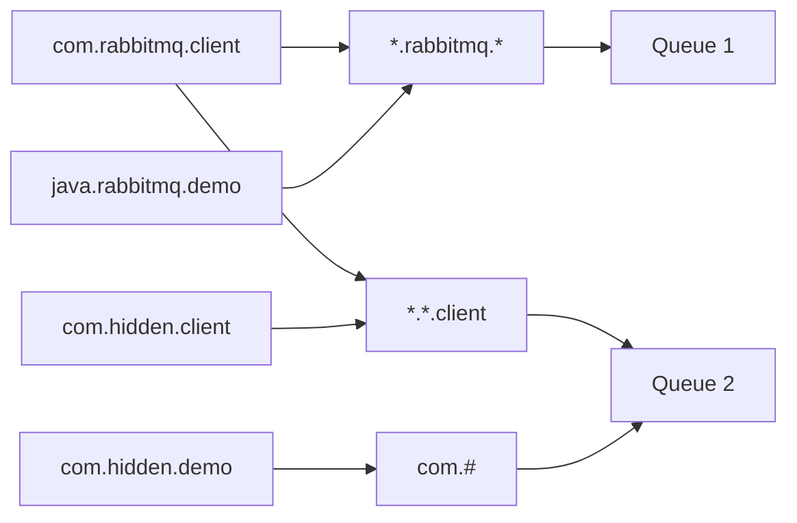

---

TODO: 将所有参数和方法名替换为 python 的。

## 交换器类型

Rabbit MQ 中的交换器有四种类型，fanout, direct, topic, headers

- fanout：它会把所有发送到该交换器的消息路由到所有与该交换器绑定的队
  列中。
- direct：它会把消息路由到那些 BindingKey 和 RoutingKey 完全匹配的队列中。
- topic：将 RoutingKey 和 BindingKey 进行模糊匹配，将消息投送到匹配成功的队列中。
- headers 类型的交换器不依赖于路由键的匹配规则来路由消息，而是根据发送的消息内容中的 headers 属性进行匹配。(性能差，不常用)

### topic 匹配规则

- RoutingKey 为一个点号“.”分隔的字符串(被点号“.”分隔开的每一段独立的字符串称为一个单词)，如“com.rabbitmq.client”、“java.util.concurrent”、“com.hidden.client”。
- BindingKey 和 RoutingKey 一样也是点号“.”分隔的字符串。
- BindingKey 中可以存在两种特殊字符串“\_”和“#”，用于做模糊匹配，其中“\_”用于匹配一个单词，“#”用于匹配多规格单词(可以是零个)。



### 名词解释

RoutingKey：路由键。生产者将消息发给交换器的时候，一般会指定一个 RoutingKey，用来指定这个消息的路由规则，而这个 Routing Key 需要与交换器类型和绑定键(BindingKey)联合使用才能最终生效。在交换器类型和绑定键(BindingKey)固定的情况下，生产者可以在发送消息给交换器时，通过指定 RoutingKey 来决定消息流向哪里。

Binding：绑定。RabbitMQ 中通过绑定将交换器与队列关联起来， 在绑定的时候一般会指定一个绑定键(BindingKey)，这样 RabbitMQ 就知道如何正确地将消息路由到队列了。

生产者将消息发送给交换器时，需要一个 RoutingKey，当 BindingKey 和 RoutingKey 相匹配时，消息会被路由到对应的队列中。在绑定多个队列到同一个交换器的时候，这些绑定允许使用相同的 BindingKey。BindingKey 并不是在所有的情况下都生效，它依赖于交换器类型，比如 fanout 类型的交换器就会无视 BindingKey，而是将消息路由到所有绑定到该交换器的队列中。

在 direct 交换器类 型下，RoutingKey 和 BindingKey 需要完全匹配才能使用，此时的 RoutingKey 和 BindingKey 是同一个东西。但是在 topic 交换器类型下，RoutingKey 和 BindingKey 之间需要做模糊匹配，两者并不是相同的。

---

Connection 可以用来创建多个 Channel 实例，但是 Channel 实例不能在线程间共享，应用程序应该为每一个线程开辟一个 Channel。某些情况下 Channel 的操作可以并发运行，但是在其他情况下会导致在网络上出现错误的通信帧交错，同时也会影响发送方确认(publisher confirm)机制的运行(详细可以参考 4.8 节)，所以多线程间共享 Channel 实例是非线程安全的。

---

queue_declare 方法中的 exclusive 参数用于设置队列是否是排他的。如果一个队列被声明为排他队列，该队列仅对首次声明它的连接可见，并在连接断开时自动删除。这里需要注意三点：排他队列是基于连接(Connection)可见的，同一个连接的不同信道(Channel)是可以同时访问同一连接创建的排他队列；“首次”是指如果一个连接已经声明了一个排他队列，其他连接是不允许建立同名的排他队列的，这个与普通队列不同；即使该队列是持久化的，一旦连接关闭或者客户端退出，该排他队列都会被自动删除，这种队列适用于一个客户端同时发送和读取消息的应用场景。

---

RabbitMQ 的消息存储在队列中，交换器的使用并不真正耗费服务器的性能，而队列会。如果要衡量 RabbitMQ 当前的 QPS 只需看队列的即可。在实际业务应用中，需要对所创建的队列的流量、内存占用及网卡占用有一个清晰的认知，预估其平均值和峰值，以便在固定硬件资源的情况下能够进行合理有效的分配。

---

## 消费消息

RabbitMQ 的消费模式分为两种：推 (push) 模式和拉 (Pull) 模式。推模式采用 Basic.Consume 进行消费，而拉模式则是调用 Basic.Get 进行消费。

Basic.Consume 将信道 (Channel) 设置为投递模式，直到取消队列的订阅为止。在投递模式期间，RabbitMQ 会不断地推送消息给消费者，当然推送消息的个数还是会受到 Basic.Qos 的限制。如果只想从队列获得单条消息而不是持续订阅，建议还是使用 Basic.Get 进行消费。但是不能将 Basic.Get 放在一个循环里来代替 Basic.Consume，这样做会严重影响 RabbitMQ 的性能。如果要实现高吞吐量，消费者理应使用 Basic.Consume 方法。

## 消费端确认/拒绝

当 AutoAck 参数设置为 False 时，对于 RabbitMQ 服务端而言，队列中的消息分成了两部分。一部分是等待投递给消费者的消息，另一部分是已经投递给消费者，但还没收到消费者确认信号的消息。在 Web 页面中分别为 Ready 和 Unacked 两列中的值。

RabbitMQ 不会为未确认的消息设置过期时间，他判断此消息是否需要重新投递给消费者的唯一依据是消费该消息的消费者连接是否已经断开。

消费者如果要明确拒绝收到的消息可以调用 channel.basic_reject 方法。其中如果 requeue 参数为 True 时，RabbitMQ 会将此消息重新入队，并发送给其他可能的消费者，如果 requeue 参数为 False，此消息将被立即从队列中移除。

channel.basic_reject 方法一次只能拒绝一条消息，批量拒绝用 channel.basic_nack 方法。

如果交换器有绑定死信队列，则被拒绝的消息会进入死信队列中。

channel.basic_recover 方法可以将未被确认的消息重入队列，如果其参数 requeue 为 False，则此消息会被分配给之前的消费者，默认为 True，消息会重新入队，可能被分配给其他消费者。

## 将消息返回给生产者

mandatory 和 immediate 是 channel.basic_publish 方法中的两个参数，它们都有当消息传递过程中不可达目的地时将消息返回给生产者的功能。RabbitMQ 提供的备份交换器 (Alternate Exchange) 可以将未能被交换器路由的消息 (没有绑定队列或者没有匹配的绑定) 存储起来，而不用返回给客户端。

### mandatory 参数和 immediate 参数

mandatory 参数设置为 True 时，如果交换器不能将消息路由到某个队列中 (路由键匹配不上)，则 RabbitMQ 会调用 channel.basic_return 方法将消息返还给生产者。设置为 False 时匹配不上直接丢弃。

immediate 参数设置为 True 时，如果交换器成功将消息路由到某个队列了，但是发现队列没有消费者，则 RabbitMQ 会调用 channel.basic_return 方法将消息返还给生产者，否则直接投递消息到队列。此参数在 RabbitMQ 3.0 版本被废弃，官方建议用过期时间 (TTL) 和死信队列 (DLX) 实现 immediate 参数的行为。

生产者可通过 channel.add_return_listener 方法监听 channel.basic_return 方法返回的消息。

### 备份交换器 Alternate Exchange

生产者在发送消息的时候如果不设置 mandatory 参数，那么消息在未被路由的情况下将会丢失。如果设置了 mandatory 参数，那么需要添加 ReturnListener 的编程逻辑，生产者的代码将变得复杂。如果既不想复杂化生产者的编程逻辑，又不想消息丢失，那么可以使用备份交换器，这样可以将未被路由的消息存储在 RabbitMQ 中，再在需要的时候去处理这些消息。

可以在调用 channel.exchange_declare 方法声明交换器时，通过传入 alternate-exchange 参数来实现备份交换器，也可以通过策略的方式实现。如果两者同时使用，则前者的优先级更高，会覆盖掉 Policy 的设置。

备份交换器其实和普通的交换器没有太大的区别，需要注意的是，消息被重新发送到备份交换器时的路由键和从生产者发出的路由键是一样的。建议将备份交换器设置为 fanout 类型以方便使用。

```python
# 声明备份交换器
```

> 备份交换器的几点特殊情况：
>
> - 如果设置的备份交换器不存在，客户端和 RabbitMQ 服务端都不会有异常出现，此时消息会丢失。
> - 如果备份交换器没有绑定任何队列，客户端和 RabbitMQ 服务端都不会有异常出现，此时消息会丢失。
> - 如果备份交换器没有任何匹配的队列，客户端和 RabbitMQ 服务端都不会有异常出现，此时消息会丢失。
> - 如果备份交换器和 mandatory 参数一起使用，那么 mandatory 参数无效。

## 过期时间 (TTL)

目前有两种方法可以设置消息的 TTL。第一种方法是通过队列属性设置，队列中所有消息都有相同的过期时间。第二种方法是对消息本身进行单独设置，每条消息的 TTL 可以不同。如果两种方法一起使用，则消息的 TTL 以两者之间较小的那个数值为准。消息在队列中的生存时间一旦超过设置的 TTL 值时，就会变成“死信” (Dead Message)。

### 设置消息的 TTL

通过队列属性设置消息 TTL 的方法是在 QueueDeclare 方法的 args 参数中加入 x-message-ttl 选项实现的，这个参数的单位是毫秒。如果不设置 TTL，则表示此消息不会过期。设置了 TTL 的队列如果消息过期，将从队列中删除。

如果将 TTL 设置为 0，则表示除非此时可以直接将消息投递到消费者，否则该消息会被立即丢弃。这个特性可以部分替代 RabbitMQ 3.0 版本 之前的 immediate 参数，除了后者在投递失败时会调用 basic_return 将消息返回。

针对每条消息设置 TTL 的方法是在调用 channel.basic_publish 方法时设置 Expiration 属性，单位为毫秒。不同于之前的方法，此种方法即使消息过期，也不会马上从队列中删除，因为每条消息是否过期是在即将投递到消费者之前判定的。

### 设置队列的 TTL

通过 channel.queue_declare 方法中 args 参数的 x-expires 选项可以控制队列被自动删除前处于未使用状态的最大时间，单位是毫秒，不能设置为 0。未使用的意思是队列上没有任何的消费者，队列也没有被重新声明，并且在过期时间段内也未调用过 basic.Get 方法。

设置队列里的 TTL 可以应用于类似 RPC 方式的回复队列，在 RPC 中，会创建很多未被使用的队列。RabbitMQ 会确保在过期时间到达后将队列删除，但是不保障删除的动作有多及时。在 RabbitMQ 重启后，持久化的队列的过期时间会被重新计算。

## 死信队列

DLX，全称为 Dead-Letter-Exchange，可以称之为死信交换器。当消息在一个队列中变成死信之后，它能被重新发送到另一个交换器中，这个交换器就是 DLX，绑定 DLX 的队列就称之为死信队列。

> 消息变成死信一般是由于以下几种情况：
>
> - 消息被拒绝（Reject/Nack），并且设置 requeue 参数为 false。
> - 消息过期。
> - 队列达到最大长度。

DLX 也是一个正常的交换器，和一般的交换器没有区别，它能在任何的队列上被指定（实际上就是设置某个队列的属性）。当这个队列中存在死信时，RabbitMQ 就会自动地将这个消息重新发布到设置的 DLX 上去，进而被路由到死信队列。可以监听这个队列中的消息以进行相应的处理，这个特性与将消息的 TTL 设置为 0 配合使用时，可以弥补 immeaiate 参数的功能。

通过在 channel.queue_declare 方法中设置 x-dead-letter-exchange 参数来为这个队列添加 DLX，也可以为这个 DLX 指定路由键，如果没有特殊指定，则使用原队列的路由键：

```python
# TODO:
```

对于 RabbitMQ 来说，DLX 是一个非常有用的特性。它可以处理异常情况下，消息不能够被消费者正确消费（消费者调用了 Nack 或者 Reject）而被置入死信队列中的情况，后续分析程序可以通过消费这个死信队列中的内容来分析当时所遇到的异常情况，进而可以改善和优化系统。

## 延迟队列

延迟队列存储的对象是对应的延迟消息，所谓“延迟消息”是指当消息被发送以后，并不想让消费者立刻拿到消息，而是等待特定时间后，消费者才能拿到这个消息进行消费。

RabbitMQ 本身没有直接支持延迟队列的功能，但是可以通过前面所介绍的 DLX 和 TTL 模拟出延迟队列的功能。

假设一个应用中需要将每条消息都设置为 10 秒的延迟，可以创建两组交换器和队列：常规交换器 exchange.normal、常规队列 queue.normal 和死信交换器 exchange.dlx、死信队列 queue.dlx，然后为 queue.normal 添加死信交换器 exchange.dlx。生产者将消息发送到 exchange.normal 并设置 TTL 为 10 秒，同时消费者订阅 queue.dlx 而非 queue.normal。当消息从 queue.normal 中过期被存入 queue.dlx 中，消费者就恰巧消费到了延迟 10 秒的这条消息。

## 优先级队列

略

## RPC 实现

略

---

channel.basic_qos 用于限制信道上的消费者所能保持的最大未确认消息的数量。

## 参考文章

[【RabbitMQ—进阶】高级用法 ](https://segmentfault.com/a/1190000040349084)
