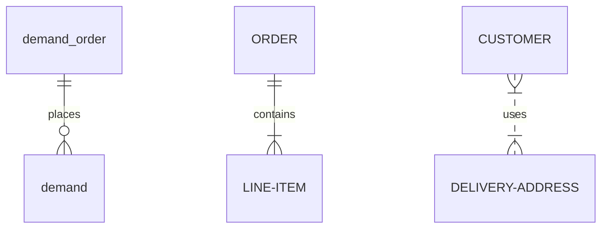

---

## 看涨期权

### 卖出实值备兑 call option 的后续操作

#### 股票跌

向下挪仓(rolling down)，买回之前的 call option（之前卖出的看涨期权此时价格下跌，买回用更少的钱），卖出行权价更低的 call option，到期日不变。此时卖出获得的现金，比买回 call option 时的花费更多，因此会产生收入。

向下挪仓会限制最大收益，但可以提供额外的下行保护。当股票下跌后反弹时将导致收益变小，所以向下挪仓的时机和挪到什么位置很重要，因为挪得过早或挪到不适当的价格都会限制收益。

另一个方法是部分卖出备兑头寸进行挪仓，此种方法特别针对股价在到期日可能反弹的情况。

#### 股票涨

向上挪仓(rolling up)，向上挪仓会产生支出，其数量与向上移动的数量一致。向上挪仓到较远的月份会减少所需支出，因为卖出远期的 call option 会得到更多的收入。

如果股价大幅上涨，建议等交割后重建头寸。

另一方案，卖出部分股票来抵消买回看涨期权和向上挪仓所支出的成本。

#### 股价不变

向前挪仓(rolling forward)，买回即将到期的看涨期权并卖出更远到期时间的期权，将获得时间价值收益。

实值情况下只要看涨期权还有时间价值，就不必担心被指派，否则，期权按持平价、贴水价交易时，需向前挪仓。

当期权为虚值时，需比较剩余日收益与长期日净收益，再决定是否要向前挪仓。
