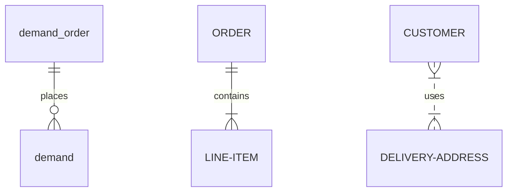

---

## 看涨期权

### 卖出实值备兑 call option 的后续操作

#### 股票跌

向下挪仓(rolling down)，买回之前的 call option（之前卖出的看涨期权此时价格下跌，买回用更少的钱），卖出行权价更低的 call option，到期日不变。此时卖出获得的现金，比买回 call option 时的花费更多，因此会产生收入。

向下挪仓会限制最大收益，但可以提供额外的下行保护。当股票下跌后反弹时将导致收益变小，所以向下挪仓的时机和挪到什么位置很重要，因为挪得过早或挪到不适当的价格都会限制收益。

另一个方法是部分卖出备兑头寸进行挪仓，此种方法特别针对股价在到期日可能反弹的情况。

#### 股票涨

向上挪仓(rolling up)，向上挪仓会产生支出，其数量与向上移动的数量一致。向上挪仓到较远的月份会减少所需支出，因为卖出远期的 call option 会得到更多的收入。

如果股价大幅上涨，建议等交割后重建头寸。

另一方案，卖出部分股票来抵消买回看涨期权和向上挪仓所支出的成本。

#### 股价不变

向前挪仓(rolling forward)，买回即将到期的看涨期权并卖出更远到期时间的期权，将获得时间价值收益。

实值情况下只要看涨期权还有时间价值，就不必担心被指派，否则，期权按持平价、贴水价交易时，需向前挪仓。

当期权为虚值时，需比较剩余日收益与长期日净收益，再决定是否要向前挪仓。

---

只要有可能在向上挪仓中得到收入，就应当这样做。

建立头寸前要对行权收益、股价不变收益、盈亏平衡点进行计算。必须将收益年化，且包括所有手续费和股息，才能对各种卖出做真正比较。

对看空股票，不应卖出其看涨期权，应略微看多，至少中性。

由于向上挪仓产生支出，如果股价高于行权价，且其他证券中有更好的投资机会，则应让股票被指派（产生股票交易手续费）。

向前挪仓可在获取收益的同时避免股票被指派产生手续费。

### 买入看涨期权

选看涨期权时，技术面分析可能比基本面更重要，因为即便有利好的基本面因素存在，也不知这些因素需要多久才能反映在股价上。

如果股价显著上涨，虚值看涨期权能提供更大的收益，上涨幅度不大时，实值看涨期权表现更好

大多看涨期权买家不会持有期权超过60天或90天。

如果投资者不善于把握时机，就应买入长期看涨期权，可降低风险。无论如何，不应买入离到期日只有一周的虚值看涨期权。

随着到期日临近，时间价值消失的速度加快。

对冲比率delta：当标的股票运动一点时，看涨期权的价格上涨、下跌的数量。

深度实值看涨期权的delta接近1，深度虚值看涨期权的delta接近0，行权价与股价相近时 delta 约为 0.5~0.6，期限长的期权其 delta 更大。

delta 是期权价格曲线的正切线的斜率。

delta 可以告诉买家标的股票的短期运动会带来多大的增值/减值，此信息可帮助买家决定买入什么样的看涨期权。

交易原则：策略的期限越短，用来交易此策略的工具的 delta 应当越高。短期实值期权的 delta 通常更高。

买入期权策略：

- 日内：最好是实股，其次短期实值，delta 最高，对股票反应最直接。

- 短线（1~2周）：短期实值，一般 delta 0.8 以上

- 中线：平值期权，较低 delta，再选择时机时无需精确。

- 长线：更低 delta，时机选择模糊。

因买入目的而对看涨期权排序时，选择标准应该基于股票的波动率。任何只考虑标的股票的百分比变化而不考虑其波动率，并由此得到的期权排序，都是没有价值的，不能被采用。

